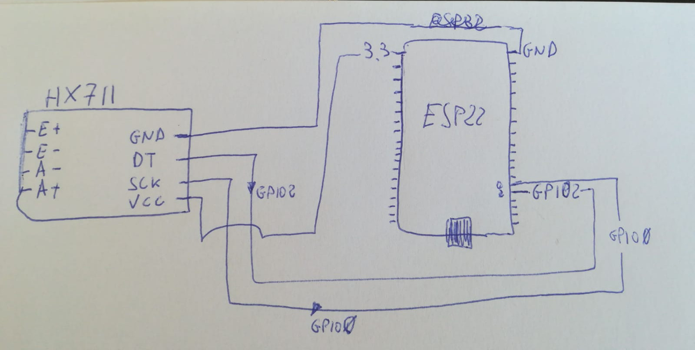

# maia
Prototipo per la costruzione di un sistema di controllo di peso e temperatura per le arnie  
#### Ingredienti:
- [Microcontrollore ESP32](imgs/esp32.jpg) [pinout](imgs/esp32_pinout.jpg)
- [Celle di carico](imgs/celle_di_carico.jpg) (4 pezzi)
- [Amplificatore segnale celle di carico HX711](imgs/hx711.jpg)
- Sensore di temperatura (esterno)
- Sensore di temperatura e umidità (interno)

#### Preparazione della scheda ESP32:
La preparazione dell'ambiente operativo della scheda ESP32 consiste nel caricare sulla stessa  il sottosistema Micropython. Viene utilizzato il tool ethtool (da installare sul proprio PC) - [questa la guida ufficiale](https://docs.micropython.org/en/latest/esp32/tutorial/intro.html#esp32-intro).
Altro tool utile da installare sul proprio pc è [ampy](https://learn.adafruit.com/micropython-basics-load-files-and-run-code/install-ampy)  

#### Collegamento tra le celle di carico:
Le 4 celle di carico vanno collegate tra loro al fine di creare un ponte di Wheatstone. Sono celle di carico a tre fili. 
Questo lo schema di collegamento:


#### Collegamento tra amplificatore celle di carico e scheda elettronica:


#### Primi test sulla scheda ESP32:
Dopo aver collegato la scheda ESP32 al proprio Pc con un cavo usb-microusb, si accede all'interprete interattivo "Micropython" eseguendo un comando da terminale tipo "minterm /dev/ttyUSB0 115200 --raw" .
Eseguendo il codice seguente, colleghiamo la scheda alla nostra rete wifi:
```python
import network
n = network.WLAN(network.STA_IF)
n.active(True)
n.scan()
n.connect("ssid","password")
# inserire il nome della propria rete wifi e la relativa password
n.ifconfig()
```
#### Installazione della libreria micropython-hx711:
Dopo aver collegato la scheda ESP32 a Internet attraverso la connessione wifi, c'è bisogno di installare nell'ambiente micropython la libreria per interfacciarsi all'amplificatore hx711.
L'installazione è semplice e consiste in 2 righe di codice:
```python
import upip
upip.install("micropython-hx711")
```

## Links
[Load Cell Amplifier Tutorial - Sparkfun](https://learn.sparkfun.com/tutorials/load-cell-amplifier-hx711-breakout-hookup-guide/all)
