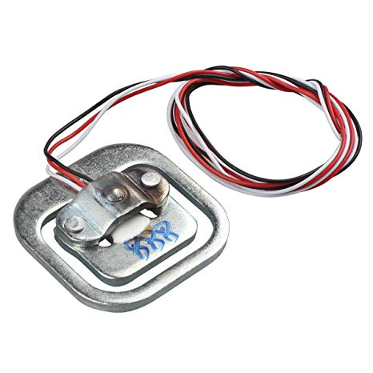
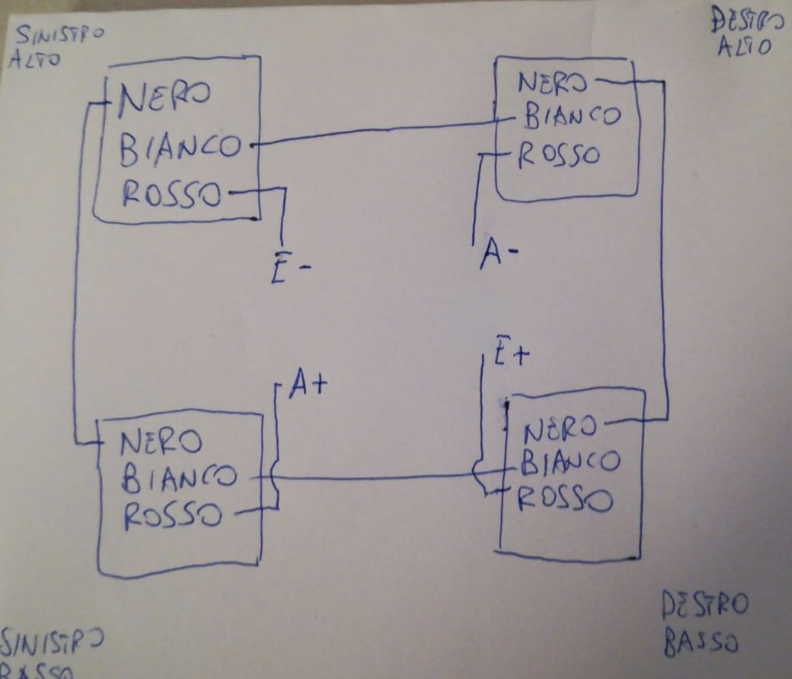
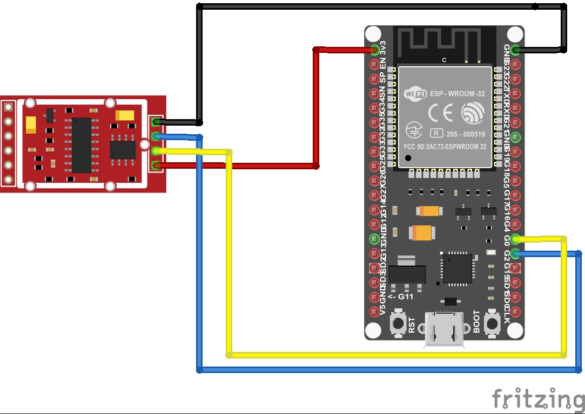

# maia
Prototipo per la costruzione di un sistema elettronico digitale di controllo per la misurazione di peso e temperatura utilizzato per il monitoraggio e telecontrollo di arnie  
#### Ingredienti:
- [Microcontrollore ESP32](imgs/esp32.jpg) - [pinout](imgs/esp32_pinout.jpg)
- [Cella di carico a tre fili - capacità 50kg](imgs/celle_di_carico.jpg) (4 pezzi)
- [Amplificatore segnale celle di carico HX711](imgs/hx711.jpg)
- [Sensore di temperatura digitale DS18B20 (per uso esterno)](imgs/ds18b20.jpg)
- [Sensore di temperatura e umidità DHT22 (per uso interno)](imgs/dht22.jpg)

#### Preparazione della scheda ESP32:
La preparazione dell'ambiente operativo della scheda ESP32 consiste nel caricare il sottosistema Micropython su di essa: viene utilizzato il tool ethtool (da installare sul proprio PC) e questa è [la guida ufficiale](https://docs.micropython.org/en/latest/esp32/tutorial/intro.html#esp32-intro).
Altro tool utile da installare sul proprio pc per interragire con la scheda Esp32 è [ampy](https://learn.adafruit.com/micropython-basics-load-files-and-run-code/install-ampy).

#### Collegamento tra le 4 celle di carico:
Le 4 celle di carico vanno collegate tra loro al fine di creare un [ponte di Wheatstone](https://it.wikipedia.org/wiki/Ponte_di_Wheatstone). Sono celle di carico a tre fili:


Questo lo schema di collegamento:  


#### Collegamento tra amplificatore celle di carico e scheda elettronica:


#### Primi test sulla scheda ESP32:
Dopo aver collegato la scheda ESP32 al proprio Pc con un cavo usb-microusb, si accede all'interprete interattivo "Micropython" eseguendo un comando da terminale tipo "miniterm /dev/ttyUSB0 115200 --raw" oppure "miniterm.py /dev/ttyUSB0 115200 --raw". Il parametro '/dev/ttyUSB0' indica la porta seriale (serial over usb) assegnata dal PC alla scheda. 
Eseguendo il codice seguente, colleghiamo la scheda alla nostra rete wifi:
```python
import network
n = network.WLAN(network.STA_IF)
n.active(True)
n.scan()
n.connect("ssid","password")
# inserire il nome della propria rete wifi e la relativa password
n.ifconfig()
```
#### Installazione della libreria micropython-hx711:
Dopo aver collegato la scheda ESP32 a internet attraverso una connessione wifi, c'è bisogno di installareal suo interno la libreria per interfacciarsi all'amplificatore hx711.
L'installazione è semplice e consiste in 2 righe di codice:
```python
import upip
upip.install("micropython-hx711")
```

#### Singola lettura di test di peso (senza calibrazione):

```python
from machine import freq
freq(160000000) # purtroppo l'oscillatore dell'amplificatore è più lento :(
from hx711 import HX711
driver = HX711(d_out=2, pd_sck=0)
driver.channel=HX711.CHANNEL_A_64
driver.read()
```
Al fine di rilevare le misurazioni di peso in kg (o in altri sistemi di misurazione) basterà calibrare il sistema supponendo che la sensoristica relativa alla misurazione si comporti come un sistema lineare (y = ax+b).
In un sistema lineare, per trovare l'equazione di una retta basta conoscere due punti(tra questi potrebbe esserci anche quello relativo a x=0) e applicare la [formula relativa](https://www.youmath.it/formulari/formulari-di-geometria-analitica/434-equazione-della-retta-passante-per-due-punti.html).  

## Links
[Load Cell Amplifier Tutorial - Sparkfun](https://learn.sparkfun.com/tutorials/load-cell-amplifier-hx711-breakout-hookup-guide/all)
