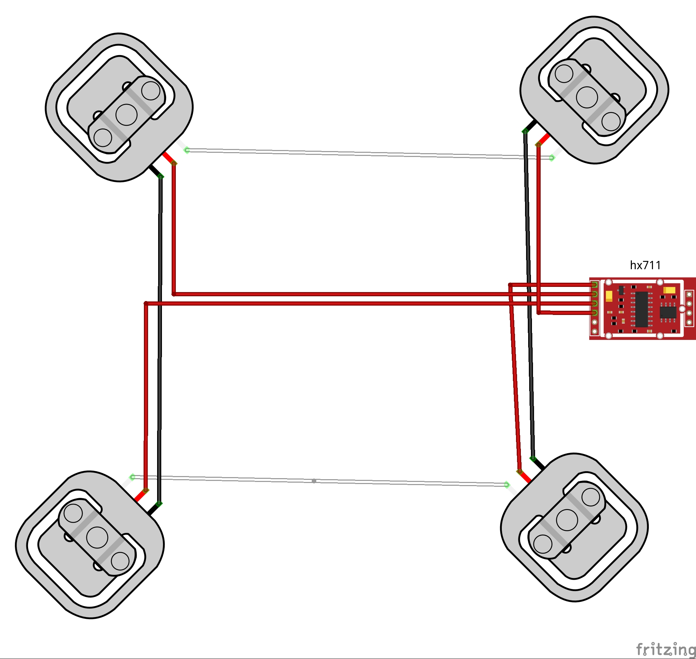
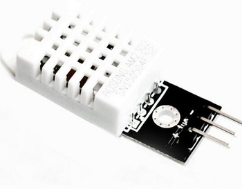
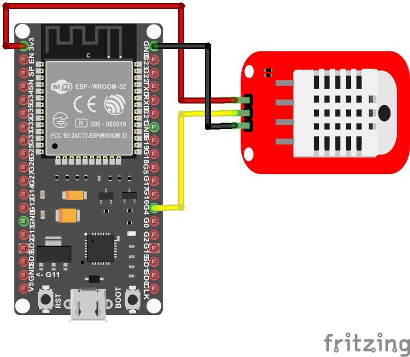
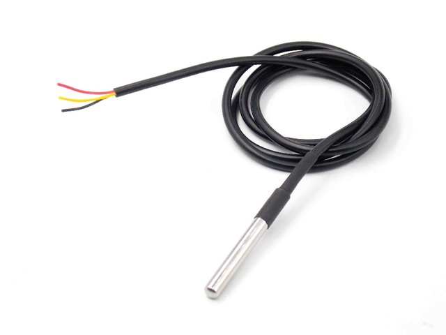
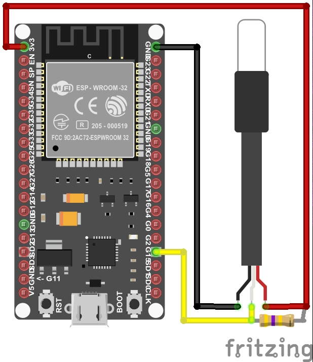

# MAIA
Progetto per la costruzione di un prototipo di un sistema elettronico digitale di controllo con misurazione di peso e temperatura. Utilizzato per il monitoraggio e telecontrollo di arnie  

#### Architettura tecnologica del sistema:
L'architettura tecnologica prevede lo sviluppo di un sistema complessivo con paradigma client-server e logica "distribuita" tra periferia e server centrale.
I nodi periferici saranno dei microcontrollori ESP32 che dialogheranno con un server centrale attraverso un brocker scambiando messaggi secondo un pattern architetturale di tipo publish/subscribe (nello specifico i nodi periferici esp32 pubblicheranno messaggi che saranno gestiti dal brocker centrale). Per lo scambio dei dati si userà il protocollo MQTT (MQ Telemetry Transport). [Ecco gli appunti sui diversi scenari](imgs/network.jpg).  
Le informazioni sintetiche che riporteranno le misurazioni dei sensori dei nodi periferici potranno essere lette da semplici client di tipo browser web. 

## Nodi periferici
#### Ingredienti:
- [Microcontrollore ESP32](imgs/esp32.jpg) - [pinout](imgs/esp32_pinout.jpg)
- [Cella di carico a tre fili - capacità 50kg](imgs/celle_di_carico.jpg) (4 pezzi)
- [Amplificatore segnale celle di carico HX711](imgs/hx711.jpg)
- [Sensore di temperatura digitale DS18B20 (uso outdoor)](imgs/ds18b20.jpg)
- [Sensore di temperatura e umidità DHT22 (uso indoor)](imgs/dht22.jpg)

#### Preparazione della scheda ESP32:
La preparazione dell'ambiente operativo della scheda ESP32 consiste nel caricare il sottosistema Micropython su di essa: viene utilizzato il tool ethtool (da installare sul proprio PC) e questa è [la guida ufficiale](https://docs.micropython.org/en/latest/esp32/tutorial/intro.html#esp32-intro).
Altro tool utile da installare sul proprio pc per interragire con la scheda Esp32 è [ampy](https://learn.adafruit.com/micropython-basics-load-files-and-run-code/install-ampy).

#### Primi test sulla scheda ESP32:
Colleghiamo la scheda ESP32 al nostro Pc con un cavo usb-microusb e attiviamo l'interprete interattivo "Micropython" eseguendo un comando da terminale tipo "miniterm /dev/ttyUSB0 115200 --raw" oppure "miniterm.py /dev/ttyUSB0 115200 --raw". Il parametro '/dev/ttyUSB0' indica la porta seriale (serial over usb) assegnata dal PC alla scheda. 
Eseguendo il codice seguente, colleghiamo la scheda alla nostra rete wifi:
```python
import network
n = network.WLAN(network.STA_IF)
n.active(True)
n.scan()
n.connect("ssid","password")
# inserire il nome della propria rete wifi e la relativa password
n.ifconfig()
```

## SENSORI DI PESO  
#### Collegamento delle 4 celle di carico:
Le 4 celle di carico devono essere collegate tra loro al fine di creare un [ponte di Wheatstone](https://it.wikipedia.org/wiki/Ponte_di_Wheatstone). Sono celle di carico a tre fili:
 

Questo lo schema di collegamento:  

Filo Rosso della cella di carico | Hx711
------------ | -------------
Cella di carico in basso a destra | E+  
Cella di carico in alto a sinistra | E-  
Cella di carico in alto a destra  | A-  
Cella di carico in basso a sinistra | A+ 



#### Collegamento tra amplificatore hx711 e scheda elettronica:
Hx711 | ESP32
------------ | -------------
GND | GND  
DT  | G02  
SCK | G00  
VCC | 3.3  


#### Installazione della libreria micropython-hx711:
Dopo aver collegato la scheda ESP32 a internet attraverso una connessione wifi, c'è bisogno di installare al suo interno la libreria per interfacciarsi all'amplificatore hx711.
L'installazione è semplice e consiste in 2 righe di codice:
```python
import upip
upip.install("micropython-hx711")
```
altra libreria "hx711" da prendere in considerazione è [questa](https://github.com/HowManyOliversAreThere/hx711_mpy-driver/blob/master/hx711.py) . Utile e da leggere anche questo [post](https://forum.micropython.org/viewtopic.php?t=2678)  

#### Singola lettura di test di peso (senza calibrazione):

```python
from machine import freq
freq(160000000) # 160Mhz purtroppo l'oscillatore dell'amplificatore è più lento :(
from hx711 import HX711
driver = HX711(d_out=2, pd_sck=0)
driver.channel=HX711.CHANNEL_A_64
driver.read()
```
Al fine di rilevare le misurazioni di peso in kg (o in altri sistemi di misurazione) basterà calibrare il sistema supponendo che la sensoristica relativa alla misurazione si comporti come un sistema lineare (y = ax+b).
Un sistema lineare è rappresentato da un modello matematico semplice (equazione di una retta), per trovare l'equazione di una retta ci sono diversi metodi e ne riporto due:
 - metodo semplice: basta conoscere due suoi punti (e tra questi potrebbe esserci anche quello relativo a x=0) e applicare la [formula relativa](https://www.youmath.it/formulari/formulari-di-geometria-analitica/434-equazione-della-retta-passante-per-due-punti.html)  
 - metodo più accurato: applicare il [metodo dei minimi quadrati](https://www.studenti.it/matematica/retta-di-regressione-lineare-62.jspc) 

   
   
## SENSORE TEMPERATURA INTERNA
Il sensore di temperatura e umidità utilizzato è il componente DHT22 su schedina elettronica a 3 Pin (in genere i 2 pin esterni sono di alimentazione, quello centrale è un pin "data out"). Questa tipologia di sensore integra sulla schedina la resistenza di pull-up tra pin "data-out" e VCC:  
       
#### Collegamento del sensore di temperatura/umidità DHT22:
Il sensore si può collegare direttamente alla scheda microcontrollore ESP32 con i seguenti collegamenti:  

DHT22 | ESP32  
------------ | -------------
MINUS(GND) | GND  
OUT | G04   
PLUS(VCC) | 3.3

  
A livello software, per la misurazione viene utilizzato un protocollo 1-wire personalizzato. La libreria utilizzata per leggere i valori di temperatura e umidità è già presente (built-in) all'interno dell'interprete Micropython flashato sulla scheda. Il codice di esempio per una singola lettura è molto semplice:

```python
import dht, machine
d = dht.DHT22(machine.Pin(4))
d.measure() # funzione da richiamare prima di ogni nuova misurazione
d.temperature()
d.humidity()
```
## SENSORE TEMPERATURA ESTERNA
Il sensore utilizzato per misurare la temperatura esterna è il componente DB18B20 (water resistant ).
Il sensore ha 3 fili (rosso Vcc,nero Ground, giallo Data Out). 


#### Collegamento del sensore di temperatura DS18B20:
Il sensore utilizza il protocollo di comunicazione 1-wire (onewire) che permette di mettere in serie molteplici sensori dello stesso tipo utilizando un singolo cavo. Nei collegamenti va tenuto conto che bisogna aggiungere una resistenza di 4.7K pull-up tra il pin data (giallo) e il pin VCC(rosso).

DSB1820 | ESP32  
------------ | -------------  
NERO(GND) | GND  
GIALLO(DATA) | G015   
ROSSO(VCC) | 3.3  

  
A livello software, la libreria utilizzata per leggere i valori di temperatura è già presente (built-in) all'interno dell'interprete Micropython flashato sulla scheda. Esempio di codice per testare il sensore ds18b20:   
```python
import time
import machine
import onewire

#colleghiamo il filo giallo del sensore al pin GPIO15 di esp32
dat = machine.Pin(15)
ds = onewire.DS18B20(onewire.OneWire(dat))

roms = ds.scan()
print('sensori:', roms)

# 10 letture
for i in range(10):
    print('temperatura:', end=' ')
    ds.convert_temp()
    time.sleep_ms(750)
    for rom in roms:
        print(ds.read_temp(rom), end=' ')
    print()
```

## Links
[Micropython](https://docs.micropython.org/en/latest/index.html)  
[Micropython Firmware ESP32](http://micropython.org/download#esp32)  
[Getting Started With Load Cells](https://learn.sparkfun.com/tutorials/getting-started-with-load-cells)  
[Load Cell Amplifier Tutorial - Sparkfun](https://learn.sparkfun.com/tutorials/load-cell-amplifier-hx711-breakout-hookup-guide/all)  
[Definizione di risoluzione sensibilita accuratezza precisione](https://www.altrasoluzione.com/blog/strumenti-di-misura-risoluzione-sensibilita-accuratezza-precisione)  
[DHT22 e protocollo di trasmissione dati](https://www.settorezero.com/wordpress/misurare-temperatura-e-umidita-relativa-con-il-sensore-dht22-e-un-picmicro/)  
[DS18b20 e ESP32](https://randomnerdtutorials.com/esp32-with-multiple-ds18b20-temperature-sensors/)  

